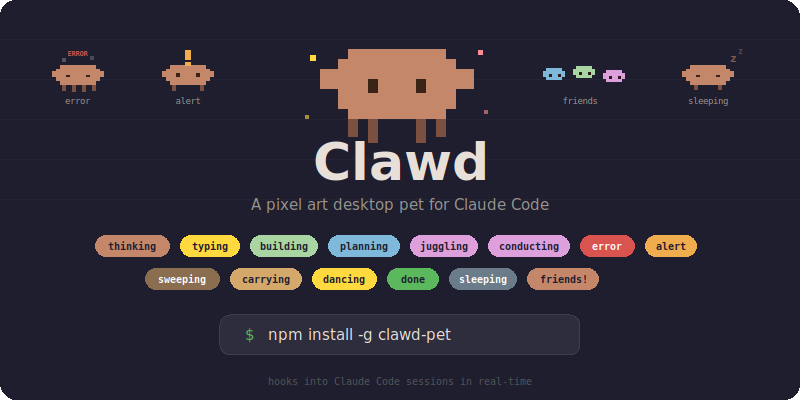

# Clawd

<p align="center">
  
</p>

A pixel art desktop pet that reacts to your Claude Code sessions in real-time.

Clawd sits on your screen, watches your mouse, and responds to what Claude Code is doing - thinking, composing, planning, or coordinating sub-agents. When idle, it dances occasionally and eventually falls asleep until you click to wake it up. When Claude finishes, a speech bubble streams the response with markdown rendering.

## Install

```bash
npm install -g clawd-pet
```

## Usage

```bash
clawd                    # Launch (auto-installs hooks + statusLine)
clawd name <name>        # Name your pet
clawd name               # Show current name
clawd uninstall          # Remove hooks and statusLine
clawd -v, --version      # Show version
clawd -h, --help         # Show help
```

## Features

### Claude Code Integration

Clawd hooks into your Claude Code session automatically:

| Claude Code state | Clawd reaction |
|---|---|
| User sends prompt | Thinking (head bob + thought bubbles) |
| Reading/searching files | Thinking |
| Editing/writing code | Composing (nodding + pencil) |
| Creating tasks/plans | Planning (looking side to side + clipboard) |
| Spawning sub-agents | Friends! (mini Clawds appear) |
| Claude finishes | Speech bubble streams the response with markdown |
| Idle | Eyes track mouse, occasional dance, eventually sleeps |

### Interactions

- **Click** - Jump! (or wake up if sleeping)
- **Drag** - Pick up and carry Clawd around (pivots from grab point)
- **Right-click** - Menu (rename, hide, quit)
- **Ctrl+Shift+P** - Toggle visibility

### Food Bar (Real Quota)

The food bar at the bottom shows your real Claude 5-hour rate limit remaining via the `statusLine` integration. Green when plenty left, yellow when getting low, red when running out.

### Speech Bubble

When Claude finishes responding, a speech bubble appears above Clawd streaming the response text character by character with full markdown support (code blocks, bold, lists, links). Click the X to dismiss or let it auto-hide after 8 seconds.

### Personality

- **Idle** - eyes follow your mouse cursor, gentle breathing
- **Dancing** - random happy dance every 25-45s while idle
- **Sleeping** - sinks behind the screen edge with floating z's after 40-60s idle. Click to wake!
- **Drag** - body sways from grab point, eyes look at where you're holding

## How it works

1. `clawd` installs hooks in `~/.claude/settings.json` for session events (UserPromptSubmit, PreToolUse, PostToolUse, Stop, etc.)
2. Hooks write state to `/tmp/claude-pet-state`, the Electron app polls it
3. A `statusLine` script reads real rate limit data and writes to `/tmp/claude-pet-food`
4. The Stop hook captures `last_assistant_message` for the speech bubble
5. Idle timers handle dance and sleep behaviors independently

## Development

```bash
git clone https://github.com/ddx-510/clawd-pet
cd clawd-pet
npm install
npm start
```

## Uninstall

```bash
clawd uninstall          # Remove hooks + statusLine from settings
npm uninstall -g clawd-pet
```

## License

MIT
